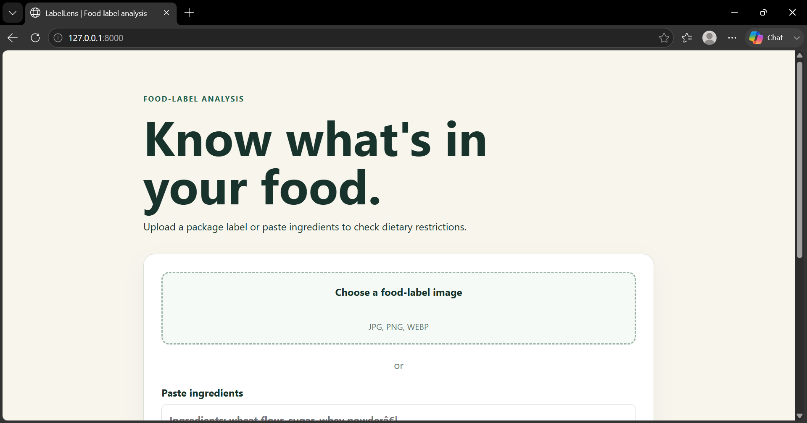
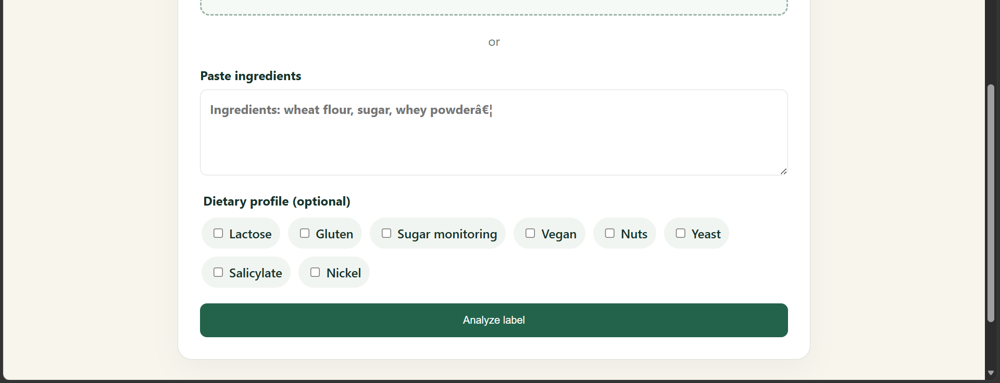
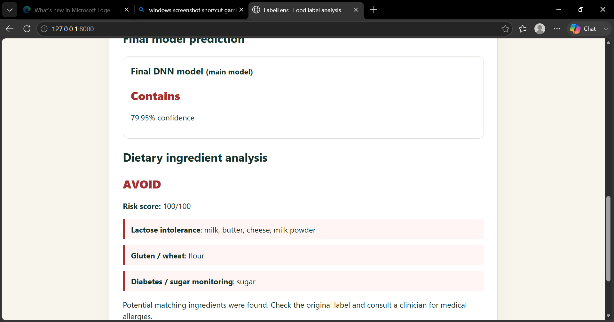

# Dietary Restrictions -LabelLens  
### Ingredient Analysis System for Personalized Dietary Restrictions

LabelLens is a deep learning-based food ingredient analysis system that helps users identify potential dietary risks from packaged food labels.

The system accepts **food label images** or **ingredient text input**, extracts ingredient information using OCR, analyzes the ingredients using a trained deep learning model, and provides an explainable dietary restriction assessment.

---

## Features

### Food Label Image Analysis
- Upload a food label image
- Extract ingredient text using OCR
- Process and normalize extracted information
- Generate dietary risk analysis

### Manual Ingredient Analysis
- Enter ingredient lists manually
- Analyze ingredients without image upload

### Deep Learning Classification
Multiple deep learning models were evaluated:

- LSTM
- CNN
- DNN

The final deployed model is:

**DNN (Deep Neural Network)**

The DNN model was selected because it provided better optimization performance with lower validation loss.

### Explainable Dietary Assessment

Instead of only providing a prediction, LabelLens shows:

- Detected risky ingredients
- Related dietary restrictions
- Recommendation messages

---

# System Overview

```
              User Input
                  |
        ----------------------
        |                    |
   Image Upload        Text Input
        |
        ↓
 OpenCV + EasyOCR
        |
        ↓
 Text Preprocessing
        |
        ↓
    DNN Model
        |
        ↓
Restriction Analysis Engine
        |
        ↓
 Final Recommendation
```

---

# Deep Leraning Models

The following models were trained and evaluated:

| Model | Accuracy | Status |
|------|----------|--------|
| LSTM | 72.5% | Not Selected |
| CNN | 98.75% | Not Selected |
| DNN | 98.75% | Selected |

Although CNN and DNN achieved similar accuracy, DNN was selected due to better validation loss performance.

---

# Technologies Used

## Backend
- Python
- Django

## Deep Learning
- TensorFlow
- Keras

## Computer Vision
- OpenCV

## OCR
- EasyOCR

## Frontend
- HTML
- CSS
- JavaScript

## Database
- SQLite

---

# Project Structure

```
Dietry_Restrictions/
│
├── Backend/
│   ├── Media
│   ├── Satatic
│   └── Templates
│   └── App
│   └── config
│   └── Analyzer
│   └── manage.py
│   └── requirements.txt
│
├── models/
│  |── train/
│   └── preprocessing.py
│   ├── Ml_model.py
│   ├── lstm_model.py
│   └── interface.py
└── README.md
```

---

# Installation

## Clone Repository

```bash
git clone https://github.com/yourusername/LabelLens.git

cd LabelLens
```

## Create Virtual Environment

```bash
python -m venv venv
```

Activate:

### Windows

```bash
venv\Scripts\activate
```

### Linux/Mac

```bash
source venv/bin/activate
```

---

## Install Dependencies

```bash
pip install -r requirements.txt
```

---

#  Run Application

Apply migrations:

```bash
python manage.py migrate
```

Start server:

```bash
python manage.py runserver
```

Open:

```
http://127.0.0.1:8000/
```

---

# Dataset

The project uses a food ingredient dataset collected from Kaggle.

The dataset contains ingredient descriptions with classification labels used for training and evaluating deep learning models.

The available labels provide general ingredient information; therefore, a hybrid approach was used:

- DNN → classification prediction
- Rule-based engine → dietary restriction identification

---

# Screenshots

## Home Interface

<p align="center">

</p>


## Food Label Upload

<p align="center">

</p>


## Dietary Analysis Result

<p align="center">

</p>

# Future Improvements

- Larger dietary restriction datasets
- Multilingual ingredient recognition
- Mobile application version
- Cloud deployment
- Improved OCR accuracy
- More advanced AI explanation methods

---

# Author

**Rashada Chowdhury**

Department of Computer Science and Engineering  
North East University Bangladesh

---

# License

This project is developed for academic purposes as part of:

**CSE-460: Deep Learning Lab**
